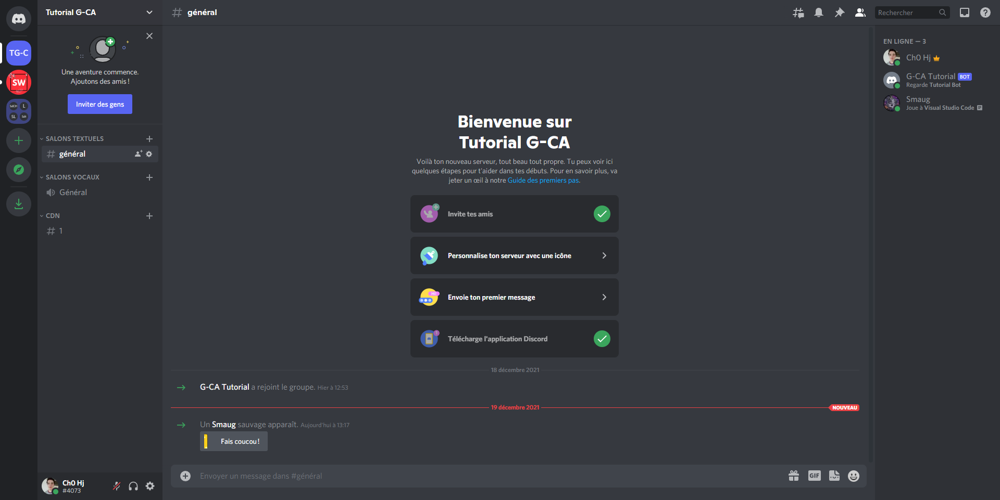

# Créer un bot discord 03/?? - Le client + mise en ligne du bot

Bienvenue dans ce nouveau chapitre sur la création de notre client Sheweny

_Ce chapitre fait parti d'une série de tutoriels. Bien qu'il soit possible de la suivre sans avoir lu les chapitres précédents, il est conseillé de les lire avant de commencer ce chapitre._

## Qu'est-ce le client ?

Le client représente notre bot, c'est le point de départ de tout bot sur discord. Depuis ce client nous recevrons les événements de Discord, nous pourrons intéragir avec certaines données mises en cache, exécuter des actions etc.

## Création du client

Notre client va être l'instance d'une classe nommée ShewenyClient. Comme pour tout ce qui vient d'une librairie, il faut l'importer. Nous allons donc nous positionner dans le fichier client.js pour cette première partie :

_client.js_

```js
const { ShewenyClient } = require("sheweny");
```

Ensuite on va instancier notre client :

```js
const client = new ShewenyClient();
```

Nous allons donc pouvoir placer les paramètres de notre client entre les paranthèses et dans des accolades (un objet).

### Les gateway intents

Vous vous souvenez du premier chapitre ? Je vous avez demandé de cocher 3 cases sur le panel de votre bot (PRESENCE_INTENTS, SERVER MEMBERS INTENT et MESSAGE CONTENT INTENT).
On appelle cela des gateway intents. Les gateway intents ont été introduites par discord dans la version 6 de leur api avant de devenir obligatoires dans la version 8. Concrètement, les intents permettent au développeurs de choisir quels événements ils souhaitent recevoir de la part de discord. Avant, par défaut les bots recevaient tous les événements ce qui générait un trafic très important de données entre le bot et discord alors que 90% des événements étaient inutiles dans la plupart des cas.
Nous avons donc vu 3 intents sur le site de discord mais en fait il y en a plein d'autres. Au total on compte plus de 16 intents. Si nous en avons vu que 3 sur le panel du bot c'est que ce sont des intents un peu spéciales. En effet en raison de la sensibilité des données qu'elles fournissent il faut les activer a la main comme nous avons fait.
Cependant cocher les cases sur le site ne suffit pas. Il nous faut également les placer dans les options de notre client.
Pour cela on va importer la classe `GatewayIntentsBits` de la librairie discord.js sous l'importation de `ShewenyClient` :

```js
const { ShewenyClient } = require("sheweny");
const { GatewayIntentsBits } = require("discord.js");

// Reste du code
```

Ensuite on va choisir d'activer 3 intents dans les options de notre client :

- `GUILDS` : Utile au bon fonctionnement de discord.js
- `GUILD_MESSAGES` : Permet de recevoir les messages des serveurs
- `MESSAGE_CONTENT`: Permet d'avoir accès au contenu des messages

Pour les intégrer à notre client on va passer par un array d'intents comme ci-dessous :

```js
const client = new ShewenyClient({
  intents: [GatewayIntentsBits.Guilds, GatewayIntentsBits.GuildMessages],
});
```

### Les partials

Les partials est une notion un peu complexe à comprendre car cela repose sur le fonctionnement interne de discord.js, mais je vais vous expliquer les grandes lignes :
Quand le bot doit recevoir un événement comme l'ajout d'une réaction à un message, il va construire un objet qui va contenir toutes les données nécessaires pour le bot. Cet objet peut reposer sur des données mises en cache, par exemple un message. Cependant, si le message n'est pas dans le cache discord.js va être dans l'incapacité de construire un objet complet et ne va donc pas émettre l'événement. Pour résoudre ce problème il faut utiliser des partials. Les partials vont forcer discord.js à émettre l'événement même si certaines données sont manquantes. De notre coté pour activer les partials nous allons faire un peu comme les intents : Nous allons faire un array qui contient toutes les partials dont nous avons besoins:

```js
const client = new ShewenyClient({
  intents: [GatewayIntentsBits.Guilds, GatewayIntentsBits.GuildMessages, GatewayIntentsBits.MessageContent]
  partials: ["Channel", "Message", "Reaction", "User", "GuildMember"],
});
```

### Le statut du bot

Ici le but de cette option va être de donner un statut à notre bot et un message. Pour cela nous allons utiliser un objet de type `Presence` comme ci-dessous :

```js
const client = new ShewenyClient({
  intents: [GatewayIntentsBits.Guilds, GatewayIntentsBits.GuildMessages, GatewayIntentsBits.MessageContent],
  partials: ["Channel", "Message", "Reaction", "User", "GuildMember"],
  presence: {
    status: "online", // online, idle, dnd, invisible
    activities: [
      {
        name: "Tutorial Bot", // Changez par ce que vous voulez
        type: ActivityType.Watching, // Watching, Playing, Streaming, Listening, Custom
      },
    ],
  },
});
```

### Les managers

Les managers vont servir au framework Sheweny pour aller chercher les fichiers de commandes, les événements dans le bon dossier. C'est également ici que on va configurer le prefixe de notre bot, les slash-commands, les permissions etc.

Dans notre cas on va commencer par 2 managers : Les commandes et les événements. On utilisera le code suivant que je vais détailler :

```js
const client = new ShewenyClient({
  intents: [GatewayIntentsBits.Guilds, GatewayIntentsBits.GuildMessages, GatewayIntentsBits.MessageContent],
  partials: ["Channel", "Message", "Reaction", "User", "GuildMember"],
  presence: {
    status: "online",
    activities: [
      {
        name: "Tutorial Bot",
        type: ActivityType.Watching,
      },
    ],
  },
  managers: {
    commands: {
      directory: "./commands",
      guildId: ["921728751434362901"],
      autoRegisterApplicationCommands: true,
    },
    events: {
      directory: "./events",
    },
  },
});
```

Chaque manager possède au moins la propriété `directory` qui indique le dossier des commandes, évents etc. Le command manager possède aussi la propriété `guildId` qui est un array qui contient les ids des serveurs sur lesquels le bot doit enregistrer les slash-commands. Si elle n'est pas spécifiée le bot enregistrera les commandes sur tous les serveurs. Ensuite on retrouve la clé `autoRegisterApplicationCommands` qui est par défaut sur true et qui indique s'il faut enregistrer les commandes de l'application. L'enregistrement des slash-commands est limité a 200 par jour et par bot donc si vous n'avez pas ajouter de nouvelle commande cette option vous permet de dire au bot que ce n'est pas la peine d'en enregistrer à nouveau.

### Exportation du client

On va exporter notre code (le rendre disponible dans d'autres fichiers) avec l'instruction suivante :

```js
module.exports = client;
```

## Mise en ligne du bot

_Cette partie du tuto se passera dans le fichier `index.js`_

Nous allons maintenant aller dans le fichier `index.js` pour y importer notre client, notre fichier de config et connecter notre bot (le mettre en ligne).

### Importations

On commence par importer le fichier de config et notre client :

```js
const client = require("./client/client.js"); // On importe le fichier que l'on vient de créer
const config = require("./config");           // On importe le fichier de configuration qui contient le token du bot
```

### Connexion du bot a discord

Pour connecter notre bot a discord nous allons utiliser la fonction `login()` sur notre client :

```js
client.login(config.token);
```

Maintenant en lançant notre bot nous allons le voir en ligne avec le statut que nous avons choisi.
Pour lancer notre bot dans un terminal ouvert dans le dossier du bot, nous allons faire la commande `node src/index.js`



## Code source final

Vous pouvez retrouver le code complet du bot sur [github](https://github.com/Sheweny/Tutorial)

_client/client.js :_

```js
const { ShewenyClient } = require("sheweny");
const { GatewayIntentsBits, ActivityType } = require("discord.js");

const client = new ShewenyClient({
  intents: [GatewayIntentsBits.Guilds, GatewayIntentsBits.GuildMessages, GatewayIntentsBits.MessageContent],
  partials: ["Channel", "Message", "Reaction", "User", "GuildMember"],
  presence: {
    status: "online",
    activities: [
      {
        name: "Tutorial Bot",
        type: ActivityType.Watching,
      },
    ],
  },
  managers: {
    commands: {
      directory: "./commands",
      guildId: ["921728751434362901"],
      autoRegisterApplicationCommands: true,
      loadAll: true,
    },
    events: {
      directory: "./events",
      loadAll: true,
    },
  },
});

module.exports = client;
```

_index.js :_

```js
const client = require("./client/client.js"); // Importation du client
const config = require("./config");           // Importation du fichier de configuration

client.login(config.token); // Connexion à discord
```

## Conclusion

Félicitations :) Votre bot est désormais en ligne. Dans ce chapitre nous avons appris :

- À instancier un client Sheweny
- À quoi servent les intents et les partials ainsi que leur mise en place
- Comment configurer le client
- Comment mettre en ligne le bot

Ce chapitre présente plusieurs notions complexes et nous aurons l'occasion de revenir dessus dans le future alors pas de panique si vous n'avez pas tout compris.

Dans le prochain chapitre nous allons créer notre première commande et évoquer les principales options de commandes

Si vous avez des questions n'hésitez pas à les poser sur le serveur de Creators Area.
