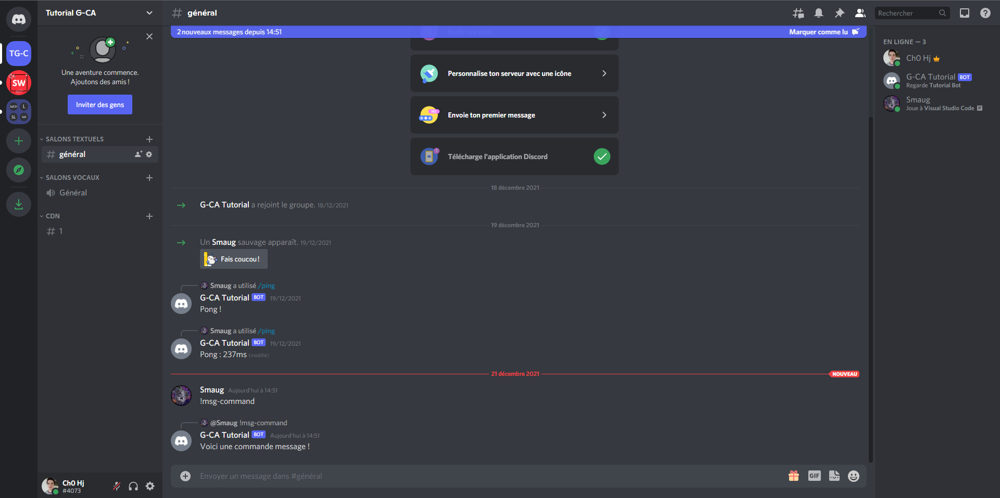

# Créer un bot discord 04/?? - Découverte des commandes message

Bienvenue dans ce nouveau chapitre dans lequel nous allons découvrir les commandes de messages. Les commandes messages ont étées les premières a apparaître sur discord.
Bien qu'aujourd'hui elles aient étées remplacées majoriatirement par les "slash-commands" elles restent utilisées dans certains cas. Etant donné que discord recommande de ne pas les utiliser, nous n'en parlerons que brièvement dans ce chapitre.

_Ce chapitre fait parti d'une série de tutoriels. Bien qu'il soit possible de la suivre sans avoir lu les chapitres précédents, il est conseillé de les lire avant de commencer ce chapitre._

## Modification de notre manager

Les message-commands ont besoins d'un prefix pour fonctionner afin d'identifier votre bot, personne n'aimerai que des commandes se déclenchent pendant une conversation.
Pour cela nous allons retourner dans notre fichier `client.js`, dans les options nous avons normalement notre commande manager :

```js
commands: {
      directory: "./commands",
      guildId: ["921728751434362901"],
      autoRegisterApplicationCommands: true,
      loadAll: true,
    },
```

Nous allons ajouter une ligne `prefix` avec une chaine de caractères qui sera le prefixe de nos commandes.

```js
prefix: "!",
```

Le manager finale devrait ressembler a ceci :

```js
commands: {
      directory: "./commands",
      guildId: ["921728751434362901"],
      autoRegisterApplicationCommands: true,
      loadAll: true,
      prefix: "!",
    },
```

On oublis pas de sauvegarder notre fichier puis on peut le fermer.

## Création de la commande

### La structure de base

On va créer une commande de base grâce à la structure `Command` que on va importer de `sheweny`.
Nous allons commencer par créer un nouveau fichier qui va contenir notre commande. Vous êtes libres d'appeler ce fichier comme vous le souhaitez du moment qu'il se situe dans le dossier `commands` . De plus, dans le dossier `commands` vous pouvez créer autant de sous-dossiers que vous le souhaitez.

```js
const { Command } = require("sheweny");

module.exports = class PingUserCommand extends Command {
  constructor(client) {
    super(client, {
      name: "msg-command",
      type: "MESSAGE_COMMAND",
      description: "Teste des commandes message",
      category: "Misc",
    });
  }

  execute(message) {
    message.reply({
      content: `Voici une commande message !`,
    });
  }
};
```

Le résultat devrait être :



### Importation et instanciation de la classe Command

Tout d'abord on importe la classe `Command` de la librairie Sheweny. Cette classe contient tous ce qui est nécéssaire a la création de n'importe quelle commande.
On utilise le mot clé `extends` pour étendre la classe et pouvoir définir le code de nos fonctions.

### Options de la commande

Nous allons donc maintenant parler de l'objet suivant :

```js
{
  name: "msg-command",
  type: "MESSAGE_COMMAND",
  description: "Teste des commandes message",
  category: "Misc",
}
```

Cet objet contient toutes les options de la commande, en premier le nom de la commande, cette key est obligatoire. Ensuite il y a le type, les valeurs possibles sont "SLASH_COMMAND", "MESSAGE_COMMAND", "CONTEXT_MENU_USER" et "CONTEXT_MENU_MESSAGE". Le type nous permet donc de créer différents types de commandes. Le type "SLASH_COMMAND" est une commande qui est appelée avec un slash. Le type "MESSAGE_COMMAND" est une commande qui est appelée avec un message. Le type "CONTEXT_MENU_USER" est une commande qui est appelée avec un menu contextuel d'un utilisateur. Le type "CONTEXT_MENU_MESSAGE" est une commande qui est appelée avec un menu contextuel d'un message. Nous auront la possibilité de reparler des types et de détailler l'utilisation de chacun d'eux.
Ensuite on a la description de la commande, cette key est obligatoire. Enfin on a la catégorie, cette key est optionnelle.
Il existe d'autres options qui seront détaillez plus tard mais vous pouvez les retrouver dans la documentation de Sheweny : [CommandOptions](https://sheweny.js.org/doc/typedef/CommandOptions.html)

### Fonction execute

On retrouve une fonction `execute()`, cette fonction contiendra l'ensemble du code de notre commande, ici nous avons simplement mis une réponse à l'utilisateur.
Pour les message-commands la fonction execute aura toujours un paramètre de type [Message](https://discord.js.org/#/docs/main/stable/class/Message)
On voit donc sur la documentation de discord.js que nous avons accès a la fonction `reply()` ce qui nous permet de répondre à l'utilisateur.

Pour les fonctions, il existe d'autres fonctions que `execute()` mais nous aurons l'occasion d'en reparler plus tard.

## La classe Message

Nous avons vu que la fonction prend un paramètre `message` quand la commande est de type `MESSAGE_COMMAND`. Cette classe est une classe de discord.js, elle contient toutes les informations sur le message. Il est possible d'accéder a beaucoup d'informations comme le serveur avec `message.guild`, le channel avec `message.channel`, le message contenu du message avec `message.content`, l'utilisateur avec `message.author` etc. Vous pouvez retrouver toutes les informations sur la documentation de discord.js : [Message](https://discord.js.org/#/docs/main/stable/class/Message)

## Le code source final

Vous pouvez retrouver le code complet du bot sur [github](https://github.com/Sheweny/Tutorial)

_client.js_

```js
const { ShewenyClient } = require("sheweny");
const { Intents } = require("discord.js");

const client = new ShewenyClient({
  intents: [Intents.FLAGS.GUILDS, Intents.FLAGS.GUILD_MESSAGES],
  partials: ["CHANNEL", "MESSAGE", "REACTION", "USER", "GUILD_MEMBER"],
  presence: {
    status: "online",
    activities: [
      {
        name: "Tutorial Bot",
        type: "WATCHING",
      },
    ],
  },
  managers: {
    commands: {
      directory: "./commands",
      guildId: ["921728751434362901"],
      autoRegisterApplicationCommands: true,
      loadAll: true,
      prefix: "!",
    },
    events: {
      directory: "./events",
      loadAll: true,
    },
  },
});

module.exports = client;
```

_msg-command.js_

```js
const { Command } = require("sheweny");

module.exports = class PingUserCommand extends Command {
  constructor(client) {
    super(client, {
      name: "msg-command",
      description: "Teste des commandes message",
      category: "Misc",
    });
  }

  execute(message) {
    message.reply({
      content: `Voici une commande message !`,
    });
  }
};
```

## Conclusion

Dans ce chapitre sur le création de notre première commande nous avons vu :

- Comment créer une commande
- Comment importer et instancier une commande
- Comment définir les options de la commande
- Comment définir la fonction execute
- Comment utiliser la classe Message

Si vous avez des questions n'hésitez pas à me contacter sur le [serveur support](https://discord.gg/euCF8bp4cN) ou via des issues sur le repo.

Passez un bon moment en codant avec Sheweny !
